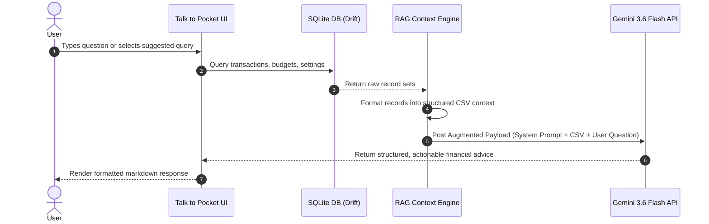

# Penny — Premium Offline Personal Finance & AI Coach

Penny is a modern, ultra-sleek, privacy-focused personal finance product built for mobile platforms. Inspired by modern fintech UI paradigms (Revolut, Wise, Apple Wallet), Penny provides instant, offline-first expense tracking, intelligent budget pacing, purchase goal milestones, and an on-device Retrieval-Augmented Generation (RAG) financial coach powered by Google Gemini.

---

## Technical Stack & Dependencies

* **Framework**: Flutter (Dart SDK ^3.8.0)
* **State Management**: Flutter Riverpod (^2.6.1)
* **Database**: Drift (^2.23.0) with SQLite3
* **AI Engine**: Google Gemini API (`gemini-3.6-flash`)
* **Visualization & UI**: `fl_chart` (0.70.2), `google_fonts` (Plus Jakarta Sans), `flutter_animate` (^4.5.0)
* **File System & Export**: `path_provider` (^2.1.5), `share_plus` (^10.1.3), `http` (^1.2.2)

---

## Core Features & Capabilities

### 1. Offline-First Database & Privacy
* Built on a local Drift SQLite database engine. All financial records, budget thresholds, and user profiles reside exclusively on the user's physical device.
* Zero external cloud database dependencies or background telemetry.

### 2. Auto-Timestamped Expenditure & Income Tracking
* Auto-logs transactions with precise timestamps (date and time).
* Interactive date-time chip picker for historical logging.
* Hero amount input field featuring dynamic font scaling based on digit length.
* Categorization into **Essential Needs** (rent, groceries, health) versus **Discretionary Wants** (dining, shopping, fun).

### 3. Dual Input Control System
* Slider controls (`CustomGradientSlider`) paired with direct numerical text fields (`TextField`).
* Synchronized two-way binding: moving the slider updates the text field in real time, and typing a custom value immediately adjusts the slider position.

### 4. Financial Health Analytics & Bezier Charts
* Real-time bezier line charts (`fl_chart`) rendering daily, weekly, monthly, and yearly expenditure trends.
* Automated financial health score calculated from essential need ratios and savings goal target margins.

### 5. CSV Data Export
* On-device generation of standard CSV files (`Date, Time, Type, Category, Amount, Essential Need, Note`).
* Native device file sharing and download integration using `share_plus`.

---

## Architecture & System Design

Penny follows a decoupled, feature-first architecture layered into presentation, domain, and data components:

```
lib/
├── core/
│   ├── database/       # Drift SQLite schema definitions and DAOs
│   ├── providers/      # Riverpod global stream/future providers
│   ├── services/       # Gemini AI service integration
│   ├── theme/          # Design tokens, mesh gradients, glassmorphism, typography
│   ├── utils/          # CSV exporter, currency helpers
│   └── widgets/        # Translucent glass cards, custom sliders, pressable scale
└── features/
    ├── ai_chat/        # "Talk to your Pocket" RAG presentation layer
    ├── budget/         # Daily limits, savings rates, purchase milestones
    ├── dashboard/      # Main hero overview, bezier charts, period scrubber
    ├── insights/       # Category breakdowns and financial health metrics
    ├── onboarding/     # Initial personalization, currency selector
    ├── settings/       # Profile management, dark mode, CSV export, data reset
    └── transactions/   # Add transaction sheet with segmented category grids
```

---

## Retrieval-Augmented Generation (RAG) Architecture

Penny implements an on-device Local RAG pipeline to power its **"Talk to your Pocket"** AI feature. Rather than uploading raw files to external vectors, the application queries its local SQLite database, structures the context, and injects it dynamically into the LLM context window.



### RAG Pipeline Mechanics

1. **Information Retrieval (Local Database Engine)**:
   When a chat session initializes, the RAG engine queries the local `Transactions`, `Budgets`, and `Settings` tables via Drift stream providers.

2. **Context Structuring (CSV Format)**:
   The retrieved data is converted into a standardized CSV string containing date, time, category, type, exact amount, and need/want flags:
   ```csv
   USER PROFILE:
   Name: Abhishek | Currency: INR (₹) | Monthly Income: ₹75000

   TRANSACTION DATABASE (CSV):
   Date,Time,Type,Category,Amount (₹),Essential Need,Note
   2026-08-20,14:30:00,EXPENSE,food,450.00,YES,"Lunch"
   2026-08-19,19:15:00,EXPENSE,fun,1200.00,NO,"Movies & Snacks"
   ```

3. **Prompt Augmentation**:
   The structured CSV text is appended to a system instruction block defining the persona ("Pocket") and operational boundaries.

4. **Generation Execution**:
   The augmented payload is processed by `gemini-3.6-flash`. Because the context includes precise CSV records, the model performs accurate calculations without hallucinating user totals.

---

## Build & Installation Guide

### Prerequisites
* Flutter SDK: `3.32.0` or higher
* Dart SDK: `3.8.0` or higher
* Android SDK API Level 21+

### Setup Instructions

1. Clone the repository:
   ```bash
   git clone https://github.com/Abhishekkx
   cd penny
   ```

2. Install dependencies:
   ```bash
   flutter pub get
   ```

3. Run static code analysis:
   ```bash
   flutter analyze
   ```

4. Run unit and widget tests:
   ```bash
   flutter test
   ```

5. Build Release APK:
   ```bash
   flutter build apk --release
   ```
   The generated APK will be available at `build/app/outputs/flutter-apk/app-release.apk`.

---

## License

Distributed under the MIT License. See `LICENSE` for more information.
